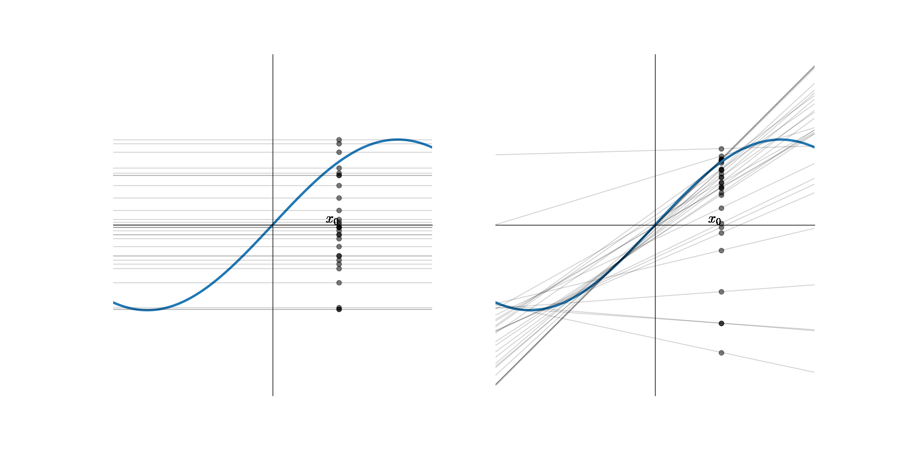
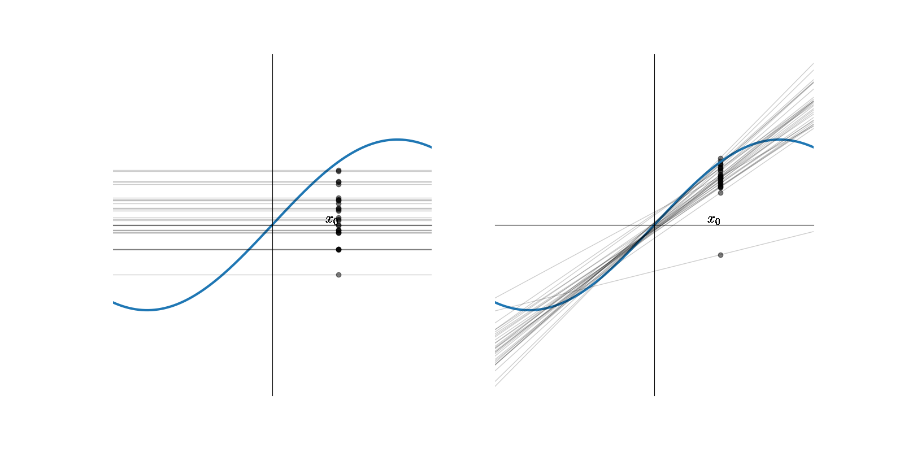
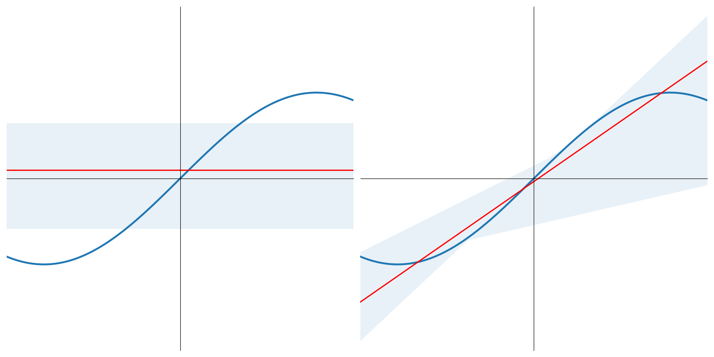
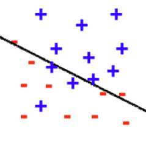
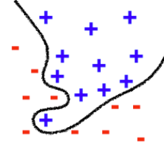
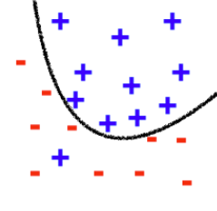

On trouvera ci-dessous une courte présentation de l'approche statistique de l'apprentissage automatique, où l'on introduit notamment les notions importantes de biais et de variance d'un modèle.

# Modèle statistique de l'apprentissage
Soient un phénomène aléatoire décrit par un vecteur aléatoire $X$ dont les composantes sont supposées indépendantes, et une variable aléatoire $Y$ (on suppose pour simplifier l'exposé que $Y$ est une variable, mais le discours s'applique sans perte de généralité s'il s'agit d'un vecteur aléatoire).

On suppose disposer de $n$ réalisations de $X$, notées $\mathbf x_i$ et un ensemble correspondant de réalisations de $Y$, le tout constituant l'ensemble d'apprentissage  $Z=\left \{(\mathbf x_i,y_i),i\in[\![1,n]\!]\right \}$.

Le plus souvent, la relation entre $X$ et $Y$ est inconnue, et on la modélise par un modèle régressif 

$$Y=f(X)+\epsilon$$

où $f$ est une fonction déterministe de $X$, et $\epsilon$ est une variable aléatoire représentant l'erreur, i.e. modélisant l'ignorance que nous avons de la dépendance entre $X$ et $Y$. On suppose souvent que $\mathbb{E}(\epsilon)=0$. On a alors les deux propriétés suivantes :
1. $\mathbb{E}(\epsilon\mid X)=0$ et ainsi $f(\mathbf x)=\mathbb{E}(Y\mid X=\mathbf x)$.
2. $\mathbb{E}(\epsilon f(X))=0$, et l'erreur est non correlée à la fonction de régression $f$. Cette propriété, connue sous le nom de principe d'orthogonalité, affirme que toute l'information sur $Y$ disponible à travers $X$ a été encodée dans $f$.

En pratique, $f$ peut être modélisée par une fonction paramétrique $f(X)=f(X,\boldsymbol{\theta}),\boldsymbol{\theta}\in \mathbb{R}^p$. 

La réponse du modèle à l'entrée $\mathbf x$ est notée $O=F(\mathbf x,\boldsymbol{\theta})$. Sur présentation de $Z$, le vecteur $\boldsymbol{\theta}$ est obtenu (en supposant une fonction de perte quadratique) par minimisation de la fonction d'erreur 

$$E(\boldsymbol{\theta}) = \frac{1}{2}\displaystyle\sum_{i=1}^n \left (y_i-F(\mathbf x_i,\boldsymbol{\theta}) \right )^2$$

Notons $\mathbb{E}_Z$ l'opérateur moyenne calculé sur l'ensemble $Z$ des paires $(\mathbf x,y)$ d'exemples (à la différence de $\mathbb{E}$ qui agit sur l'ensemble des possibles sur $X$ et $Y$). Puisque l'information sur $Z$ est codée dans $\boldsymbol{\theta}$, on peut substituer $F(\mathbf x,Z)$ à la notation $F(\mathbf x_i,\boldsymbol{\theta})$ et l'erreur  se réécrit alors :

$$E(\boldsymbol{\theta}) = \frac{1}{2} \mathbb{E}_Z \left (y-F(\mathbf x,Z) \right )^2$$

or

$$y-F(\mathbf x,Z) = (y-f(\mathbf x)) + \left (f(\mathbf x)-F(\mathbf x,Z)\right ) = \epsilon + \left (f(\mathbf x)-F(\mathbf x,Z)\right )$$

et en substituant dans l'erreur et en développant 

$$E(\boldsymbol{\theta}) = \frac{1}{2} \mathbb{E}_Z \left (\epsilon^2 \right )+\frac{1}{2} \mathbb{E}_Z \left (f(\mathbf x)-F(\mathbf x,Z)\right )^2+\mathbb{E}_Z \left (\epsilon\left (f(\mathbf x)- F(\mathbf x,Z)\right ) \right )$$

Or, le dernier terme de cette somme est nul et donc 

$$E(\boldsymbol{\theta}) = \frac{1}{2} \mathbb{E}_Z \left (\epsilon^2 \right )+\frac{1}{2} \mathbb{E}_Z \left (f(\mathbf x)-F(\mathbf x,Z)\right )^2$$

Le premier terme de cette somme est la variance de l'erreur $\epsilon$, évaluée sur $Z$. Elle représente l'erreur intrinsèque, car elle est indépendante du vecteur $\boldsymbol{\theta}$. Elle peut donc être ignorée dans la minimisation de $E(\boldsymbol{\theta})$. Une mesure naturelle du pouvoir de prédiction du modèle paramétré par $\boldsymbol{\theta}$ est donc 

$$L_{av}\left (f(\mathbf x),F(\mathbf x,\boldsymbol{\theta}) \right ) = \mathbb{E}_Z \left (f(\mathbf x)-F(\mathbf x,Z)\right )^2$$

# Dilemne biais/variance
## Biais et Variance

Puisque $f(\mathbf x)=\mathbb{E}(Y\mid X=\mathbf x)$, l'erreur quadratique entre $f(\mathbf x)$ et $F(\mathbf x,Z)$ peut s'écrire

$$L_{av}\left (f(\mathbf x),F(\mathbf x,\boldsymbol{\boldsymbol{\theta}}) \right ) = \mathbb{E}_Z \left (\mathbb{E}(Y\mid X=\mathbf x)-F(\mathbf x,Z)\right )^2$$

ce qui permet d'exprimer cette erreur comme la valeur moyenne sur $Z$  de l'erreur d'estimation entre $f(\mathbf x)$ et $F(\mathbf x,Z)$.  On a alors 

$$\mathbb{E}(Y\mid X=\mathbf x)-F(\mathbf x,Z)=\left (\mathbb{E}(Y\mid X=\mathbf x)-\mathbb{E}_Z\left ( F(\mathbf x,Z)\right ) \right ) + \left (\mathbb{E}_Z\left ( F(\mathbf x,Z)\right )-F(\mathbf x,Z) \right )$$

et l'erreur quadratique s'écrit donc :

$$L_{av}\left (f(\mathbf x),F(\mathbf x,\boldsymbol{\theta}) \right ) = B^2(\boldsymbol{\theta}) + V(\boldsymbol{\theta})$$

avec : 
- $B(\boldsymbol{\theta}) = \mathbb{E}_Z\left ( F(\mathbf x,Z)\right )-\mathbb{E}(Y\mid X=\mathbf x)$ le biais de la valeur moyenne de $F(\mathbf x,Z)$, mesurée par rapport à $f(\mathbf x)$. Ce terme représente l'incapacité du modèle à approximer la fonction de regression $f$. La classe de fonctions choisie limite en effet la précision avec laquelle on peut approcher $f$. C'est donc une erreur d'approximation. En général, son estimation, cruciale, est difficile à réaliser car elle requiert une connaissance des propriétés de $f$ (régularité,...), qui sont justement inconnues. 
- $V(\boldsymbol{\theta})= \mathbb{E}_Z\left ( \left ( F(\mathbf x,Z)- \mathbb{E}_Z\left (F(\mathbf x,Z)\right ) \right )^2\right )$ la variance de la fonction $F(\mathbf x,Z)$ mesurée sur $Z$. Ce terme représente l'insuffisance de l'information portée dans $Z$ pour l'approximation de $f$. C'est donc une erreur d'estimation. On peut le relier à la façon dont le modèle change sur des ensembles d'apprentissage différents. Il a été montré que les vitesses de convergence de l'erreur d'estimation peuvent être calculées sans connaitre a priori les propriétés de $f$.

Pour de bonnes performances de la fonction d'approximation $F(\mathbf x,\boldsymbol{\theta})$, $B(\boldsymbol{\theta})$ et $V(\boldsymbol{\theta})$ doivent simultanément être petits. Cependant, sur des processus d'apprentissage sur un ensemble $Z$ de taille $n$ fixée, le prix à payer pour un biais faible est une grande variance. Ce compromis s'appelle le dilemne biais-variance. 

## Illustrations
De l'analyse précédente, on en déduit que plus complexe sera l'espace des fonctions $\mathcal{F}$, meilleure sera la chance d'approcher $f$, et que plus petit cet espace sera, meilleure sera la chance que l'algorithme généralise bien.

Supposons  $f(x) = sin(x),x\in[-\pi,\pi]$ et que l'ensemble d'apprentissage $Z$ soit constitué de deux points tirés au hasard sur cette courbe. Supposons de plus que $\mathcal{F}$ soit composé des fonctions constantes et des polynomes de degré 1.

On apprend sur $N$ ensembles d'apprentissage $Z_i$ $N$ modèles constants et $N$ modèles linéaires $F^{Z_i}(x,w)$, pour reprendre les notations précédentes 

Pour un $x_0$ donné, on obtient $N$ réalisations $F^{Z_i}(x_0,w)$ d'une variable aléatoire, dépendant de l'ensemble d'apprentissage (points sur la figure précédente). En moyennant sur les $N$ modèles, on obtient un modèle constant et un modèle linéaire $\bar{F}$ moyens 

Alors $\bar{F}(x,\boldsymbol{\theta}) = \mathbb{E}_Z(F^{Z}(x_0,\boldsymbol{\theta}))\approx \frac{1}{N}\displaystyle\sum_{i=1}^N F^{Z_i}(x_0,\boldsymbol{\theta})$

et $Var(F)(x,\boldsymbol{\theta}) = \mathbb{E}_Z \left((F^Z(x_0,\boldsymbol{\theta})-\bar {F}(x_0,\boldsymbol{\theta}))^2\right) =  \mathbb{E}_Z (F^Z(x_0)^2)-\bar{F}(x_0,\boldsymbol{\theta})^2$

L'erreur entre la sortie du modèle et la sortie théorique, moyennée sur les points de test  (qui mesure donc l'erreur en généralisation) s'écrit donc, comme précédemment :

$$
\begin{array}{ccl}
    L_{av}\left (f(x),F(x,\boldsymbol{\theta}) \right )&=& \mathbb{E}_Z   \left((F^Z(x,\boldsymbol{\theta})-f(x))^2\right)\\
    &=&\mathbb{E}_Z   \left(F^Z(x,\boldsymbol{\theta})^2 -2F^Z(x,\boldsymbol{\theta})f(x) +f(x)^2\right)\\
    &=&\mathbb{E}_Z (F^Z(x,\boldsymbol{\theta})^2)-2\bar {F}(x,\boldsymbol{\theta})f(x) + f(x)^2\\
    &=&\mathbb{E}_Z (F^Z(x,\boldsymbol{\theta})^2)-\bar {F}(x,\boldsymbol{\theta})^2+\bar {F}(x,\boldsymbol{\theta})^2-2\bar {F}(x,\boldsymbol{\theta})f(x) + f(x)^2\\
    &=&\mathbb{E}_Z (F^Z(x,\boldsymbol{\theta})^2)- \bar {F}(x,\boldsymbol{\theta})^2+ (\bar {F}(x,\boldsymbol{\theta})-f(x))^2\\
    &=&V(\boldsymbol{\theta}) + B^2(\boldsymbol{\theta})
\end{array}
$$

En reprenant la figure précédente :
- pour le modèle constant, $B$=0.5, $V$=0.25 et $L_{av}\left (f(x),F(x,\boldsymbol{\theta}) \right )=0.75$
- pour le modèle affine, $B$=0.21, $V$=1.69 et $L_{av}\left (f(x),F(x,\boldsymbol{\theta}) \right )=1.90$

et le "meilleur" modèle (en généralisation) est le modèle constant (soit le "moins compliqué").

Si l'on étend cette approche à 5 points d'apprentissage, on montre facilement que $L_{av}\left (f(x),F(x,\boldsymbol{\theta}) \right )$ est égal à 0.6 pour le modèle constant, et 0.42 pour le modèle affine 

En illustrant cette fois-ci sur un problème de classification, on pourra penser au biais et à la variance comme sur la figure suivante.

  

