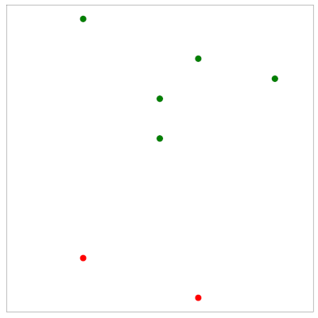

Apprendre est il possible ? On s'intéresse ici à quelques aspects théoriques sur cette question.


# Exemple introductif
## Tirage dans une urne
Soit une urne remplie de boules noires et blanches. On note $\mu$ la probabilité (inconnue) de tirer une boule noire. On tire un échantillon $Z$ de $n$ boules et on note $\nu$ la proportion de boules noires dans $Z$. En "langage" apprentissage, $Z$ sont les exemples d'apprentissage, l'urne est la population sur laquelle on souhaite faire une prédiction (classification ou régression). 

On se pose alors la question suivante : $\nu$ dit-elle quelque chose sur $\mu$ ? Deux réponses sont alors envisageables : 
- la possible : non, $Z$ peut être majoritairement composé de boules blanches, alors que l'urne est majoritairement remplie de boules noires.
- la probable : oui, $\mu$ vue comme une fréquence doit être proche, sous certaines conditions, de $\mu$.


## Inégalités de Hoeffding
Interéssons nous à l'aspect probable : si $n$ est grand, $\nu$ doit être proche de $\mu$, et plus précisément :
```{prf:proposition} Inégalités de Hoeffding
$$    (\forall \epsilon>0)\ P(|\nu-\mu|>\epsilon)\leq 2e^{-2\epsilon^2n}
\textrm{ et } P(|\nu-\mu|\leq\epsilon)\geq 1-2e^{-2\epsilon^2n}$$
```
La borne ne dépend pas de $\mu$ et il est donc possible de jouer sur $\epsilon$ et $n$ pour assurer une borne aussi petite que l'on veut. Par exemple si $n=10^3$ :
- pour $\epsilon=5.10^{-2},\  \nu-5.10^{-2}\leq \mu\leq \nu+5.10^{-2}$ avec probabilité $0.99$.
- pour $\epsilon=1.10^{-1},\  \nu-1.10^{-1}\leq \mu\leq \nu+1.10^{-1}$ avec probabilité $1-4.10^{-7}$.

En répétant le tirage indépendant de 1000 boules pour constituer $Z$, et en observant $\nu$, on peut donc affirmer par exemple que $\mu\in[\nu-5.10^{-2},\nu + 5.10^{-2}]$ est vrai 99\% du temps.


## Relation à l'apprentissage - Erreurs d'entraînement et de généralisation
En apprentissage, l'inconnue n'est pas un réel ($\mu$), mais une fonction $f:X\rightarrow Y$. Le candidat est lui aussi une fonction $h$ appartenant à un ensemble $\mathcal{F}$ .Dans la {numref}`fhe-ref`, la figure de gauche présente un exemple de fonction $f$ à atteindre, celle du milieu une hypothèse $h$ (classification binaire). La fonction d'erreur (à droite) donne le lieu des points $\mathbf x$ tels que $h(\mathbf x)=f(\mathbf x)$ (bleu), $h(\mathbf x)\neq f(\mathbf x)$ (rouge). L'erreur de $h$ est donc $E(h)=P_\mathbf x(h(\mathbf x)\neq f(\mathbf x))$ (l'aire de la région rouge).


 ```{figure} ./images/fhe.png 
:name: fhe-ref
Erreur mesurée sur les échantillons(jaune)
```


En pratique, l'espace $X$ est échantillonné et l'erreur de $h$ est mesurée sur les échantillons et est  dite erreur "out of sample" (ou erreur de généralisation) ({numref}`errors-ref`):

$$E_g(h) = P_\mathbf x(h(\mathbf x)\neq f(\mathbf x))$$

```{figure} ./images/errorsample.png
:name: errors-ref
Erreur mesurée sur les échantillons(jaune)
```

De plus, un problème d'apprentissage supervisé vient naturellement avec un ensemble d'apprentissage $Z=\left \{(\mathbf x_i,y_i),1\leq i\leq n,\mathbf x_i\in X,y_i\in Y \right \}$, ce qui permet d'évaluer l'erreur d'apprentissage de $h$ à partir de $Z$, dite erreur 'in sample'  (ou erreur d'apprentissage) ({numref}`errors-in-ref`). 

$$E_t(h) = \frac{1}{n}\displaystyle\sum_{i=1}^n \mathbb{I}_{h(\mathbf x_i)\neq f(\mathbf x_i)}$$


```{figure} ./images/targetfZ.png
:name: errors-in-ref
Points d'apprentissage de $Z$, et leur projection sur la fonction d'erreur. Les points bien classés sont en bleu, les mal classés en rouge. L'erreur d'apprentissage  est la proportion de points rouge.
```


En résumé :


<p align=center>

| Urne      | Apprentissage |
| ----------- | ----------- |
| Boules noires      | $\mathbf x$ tels que $h(\mathbf x)\neq f(\mathbf x)$       |
| Boules blanches   | $\mathbf x$ tels que $h(\mathbf x)= f(\mathbf x)$        |
| Tirage d'une boule | $P(\mathbf x)$ | 
| Tirage de $n$ boules | $Z$ |
|   $\mu$ : probabilité de tirer une boule noire  | $E_g(h) = P_\mathbf x(h(\mathbf x)\neq f(\mathbf x))$ |
|   $\nu$ : proportion de boules noires dans $Z$ | $E_t(h) = \frac{1}{n}\sum_{i=1}^n \mathbb{I}_{(h(\mathbf x)\neq f(\mathbf x))}$ |


</p>


$E_t(h)$ est aléatoire, mais connue, $E_g(h)$ est fixe mais inconnue, et les inégalités d'Hoeffding quantifient à quel point $E_t(h) \approx E_g(h)$ :

$$
\begin{array}{ccc}
    (\forall \epsilon>0)&& P(|E_t(h)-E_g(h)|>\epsilon)\leq 2e^{-2\epsilon^2n}\\
    && P(|E_t(h)-E_g(h)|\leq\epsilon)\geq 1-2e^{-2\epsilon^2n}
\end{array}
$$

Si $E_t(h)\approx 0$ alors $E_g(h)\approx 0$ avec forte probabilité. On a appris quelque chose sur $f$, puisque $f\approx h$ sur tout $X$ et pas seulement sur $Z$. Si $E_t(h)>>0$ on peut juste dire que $f\neq h$.


## Recherche d'un bon candidat
Ainsi, il est intéressant pour conclure quelque chose que $E_t$ soit petite. En apprentissage, on recherche donc dans un espace de fonctions $\mathcal{F}$ une fonction $g$ ayant une erreur d'apprentissage $E_t(g)$ la plus petite possible.

On note $|\mathcal{F}| = M$, et pour $h_j\in \mathcal{F}$, on définit l'évènement 

$$A_j = \{|E_t(h_j)-E_g(h_j)|>\epsilon\}$$

Par les inégalités de Hoeffding, on a $P(A_j)\leq 2e^{-2\epsilon^2n}$. 

$$\begin{array}{ccc}
    P(\exists h_j\in \mathcal{F}, |E_t(h_j)-E_g(h_j)|>\epsilon) &=& P(A_1\cup A_2\cdots \cup A_M)\\
    &\leq &\displaystyle\sum_{i=1}^M P(A_i)\\
    &\leq &\displaystyle\sum_{i=1}^M 2e^{-2\epsilon^2n}\\
    &=& 2Me^{-2\epsilon^2n}
\end{array}
$$

d'où  :

$$
    \begin{array}{ccc}
        P(\nexists h_j\in \mathcal{F}, |E_t(h_j)-E_g(h_j)|>\epsilon) &=& P(\forall h_j\in \mathcal{F}, |E_t(h_j)-E_g(h_j)|\leq \epsilon)\\
        &\geq& 1-2Me^{-2\epsilon^2n}
    \end{array}
$$

Avec probabilité $P = 1-2Me^{-2\epsilon^2n}$, $E_t$ sera donc à $\epsilon$ près de $E_g$ et ceci pour tout $h\in \mathcal{F}$. La convergence sera d'autant meilleure que $n$ est grand.


On peut alors s'intéresser à la taille de $Z$ qui assure une 'bonne' convergence. A $P$ et $\epsilon$ fixés, on voit alors que tant que 

$$n\geq \frac{1}{2\epsilon^2}log\frac{2M}{P}$$ 

alors avec probabilité $1-P$, $|E_t(h)-E_g(h)|\leq \epsilon$ pour tout $h\in \mathcal{F}$. 


De même on peut résoudre en $\epsilon$ : à $n$ et $P$ fixé, on voit qu'avec probabilité $1-P$ on a pour tout $h\in \mathcal{F}$ :  

$$|E_t(h)-E_g(h)|\leq\sqrt{\frac{1}{2n}log\frac{2M}{P}}$$


Supposons maintenant que $\forall h\in \mathcal{F},|E_t(h)-E_g(h)|<\epsilon$, peut on en déduire quelque chose sur $E_g(g)$ ?

Puisque :

$$
\begin{array}{ccl}
(\forall \epsilon>0)&& P(|E_t(h)-E_g(h)|>\epsilon)\leq 2e^{-2\epsilon^2n}\\
g&=&Arg \displaystyle\min_{h\in \mathcal{F}} E_t(h)
\end{array}
$$

alors en notant $h^* = Arg \displaystyle\min_{h\in \mathcal{F}} E_g(h)$, on a : 

$$
\begin{array}{ccl}
    E_g(g)&\leq& E_t(g) +\epsilon\quad \textrm{[Inégalité de Hoeffding pour $g$]}\\
    &\leq& E_t(h^*)+\epsilon\quad \textrm{[Propriété de $g$]}\\
    &\leq&E_g(h^*)+2\epsilon \quad \textrm{[Inégalité de Hoeffding pour $h^*$]}
\end{array}
$$


et pour garantir cette dernière inégalité avec probabilité $1-P$, il suffit comme nous l'avons vu que 

$$n\geq \frac{1}{2\epsilon^2}log\frac{2M}{P}$$

Ainsi si $n>>log M$ alors $E_g(g)\approx E_t(g)$, indépendamment de $X$, de la distribution $P(\mathbf x)$, de $f$ ou de l'algorithme ayant généré $g$.


L'analyse précédente dit donc que $E_t(g)\approx 0$, que sous la condition sur $n$ alors $E_g(g)\approx E_t(g)$, et que donc l'erreur en généralisation de $g$ est faible. 


Puisque $E_g(g)\leq E_t(g) +\epsilon$ et $\epsilon=\sqrt{\frac{1}{2n}log\frac{2M}{P}}$, on en déduit que si $M$ est petit alors probablement $E_t(g)\approx E_g(g)\approx 0$, et que si $M$ est grand alors $\epsilon$ est possiblement grand et $E_g(g)$ peut s'éloigner de $E_t(g)$ ({numref}`courbes-err-ref`).


```{figure} ./images/bv.png
:name: courbes-err-ref
Courbes des erreurs. La courbe rouge représente la complexité du modèle, la courbe bleue l'erreur d'apprentissage et la courbe verte l'erreur en généralisation. Passé $M^*$, le modèle a tendance à surapprendre $Z$ et l'erreur en généralisation croît
```


Exemple : $\mathcal F$ est l'ensemble des polynomes de degré $M$. $M$ faible signifie par exemple approcher $f$ par une hypothèse linéaire (sous-apprentissage), et $M$ fort signifie approcher $f$ par un polynôme 
de degré élevé (l'erreur d'entraînement sera très faible, en revanche en raison du sur apprentissage $g$ n'aura aucune capacité de généralisation ({numref}`apprendre-ref`).

```{figure} ./images/apprendre.png
:name: apprendre-ref
Sous et sur apprentissage dans le cas de modèles polynomiaux.
```

# Théorie de la généralisation

La théorie de la généralisation va permettre d'étendre la borne 

$$|E_t(g)-E_g(g)|\leq\sqrt{\frac{1}{2n}log\frac{2M}{P}}$$

au cas où $\mathcal F$ est infini.

Quantifier la taille de $\mathcal F$ par son cardinal $M$ n'est pas nécessairement pertinent, puisque cette information ne capture pas 
les possibles similarités entre $h\in \mathcal F$. $M$ mesure donc la diversité maximum de  $\mathcal F$ et il 
faut trouver une mesure de diversité qui soit pertinente pour le problème de l'apprentissage. On parle également de pouvoir d'expression de cet ensemble.

## Dichotomies
Une première idée est de fixer $n$ points $Z=\{\mathbf x_i\in X,i\in [\![1,n]\!]\}$ et d'affirmer que $\mathcal F$ a un bon pouvoir d'expression s'il peut calculer toutes les fonctions sur ces $n$ points. 

La figure suivante présente un exemple. $\mathcal{F}$ est un ensemble de droites, et $Z$ contient 7 points (bleu). Du point de vue de $Z$, $\mathcal{F}$
réalise juste une séparation binaire de ses points en deux sous-ensembles, les verts et  les rouges. La fonction correspondante réalsée est appelée une dichotomie. Pout $h\in \mathcal{F}$, 
la dichotomie calcule un $n$-uplet de valeurs $\pm 1$ $(h(\mathbf x_1)\cdots h(\mathbf x_n))$, $h(\mathbf x_i)$ correspondant à la classe de $\mathbf x_i$ vue par $h$.


| $\mathcal{F}$| Séparation binaire | 
|------------|-------|
|       |      | 


## Fonction de croissance
Si $\mathcal{F}$ a fort un pouvoir d'expression, il doit être capable de réaliser de nombreuses dichotomies de $Z$. Pour quantifier ce point, on introduit la fonction de croissance.

````{prf:definition} Fonction de croissance
Soit $Z=\{\mathbf x_i\in X,i\in [\![1,n]\!]\}$ un ensemble de $n$ points de $X$.  On note 

$$\mathcal{H}(Z) = \left \{ (h(\mathbf x_1)\cdots h(\mathbf x_n)),h\in \mathcal{F}\right \}$$

l'ensemble des dichotomies induites par $\mathcal{F}$ sur $Z$. 

La fonction de croissance de $\mathcal{F}$ est le nombre maximum de dichotomies induites par $\mathcal{F}$ sur tout ensemble de $n$ points : 

$$\Delta_\mathcal{F}(n) = \displaystyle \max_{Z,|Z|=n} |\mathcal{H}(Z)|$$
````

Bien évidemment $\Delta_\mathcal{F}(n)\leq 2^n$. Pour mesurer la diversité de $\mathcal{F}$, on souhaiterait alors remplacer $M$ par $\Delta_\mathcal{F}$.

Exemple : soit $a\in [-1,1]$ et  $\mathcal{F} = \left \{h: \mathbb{R} \rightarrow [-1,1], h(x) = signe(x-a) \right \}$. Il y a alors $n+1$ dichotomies d'un ensemble
    de $n$ points, suivant la position de $a$ dans l'intervalle [-1,1]. Ainsi $\Delta_\mathcal{F}(n) = n+1$.


````{prf:definition} Pulvérisation
Soit $Z=\{\mathbf x_i\in X,i\in [\![1,n]\!]\}$ un ensemble de $n$ points de $X$ et $\mathcal{F}$ un ensemble de fonctions. On dit que $\mathcal{F}$ pulvérise $Z$
si $\Delta_\mathcal{F}(n)=2^n$.
````


Autrement dit, $Z$ est pulvérisé par $\mathcal{F}$ si toutes les dichotomies possibles sur $Z$ peuvent être décrites par des fonctions de $\mathcal{F}$.

````{prf:definition} Point d'arrêt
Un point d'arrêt $k\in \mathbb N$ est tel qu'aucun ensemble de $k$ points de $X$ ne puisse être pulvérisé par  $\mathcal{F}$.
````

On a alors bien évidemment $\Delta_\mathcal{F}(k)<2^k$. Les points d'arrêt sont généralement plus faciles à trouver que la fonction de croissance.

On a alors les résultats suivants : 
```{prf:proposition}
Soit $n\in \mathbb N$ et $\mathcal{F}$ un ensemble de fonctions : 
- s'il n'existe aucun point d'arrêt $k\leq n$ alors $\Delta_\mathcal{F}(n)=2^n$
- s'il existe $k<n$ point darrêt, alors $\Delta_\mathcal{F}(n)$ est polynomial en $n$
```
`

```{prf:theorem}
Soit  $\mathcal{F}$ un ensemble de fonctions. S'il existe $k\in\mathbb{N}$ tel que $\Delta_\mathcal{F}(k)<2^k$ alors :

$$(\forall n\in \mathbb{N})\ \Delta_\mathcal{F}(n)\leq \displaystyle\sum_{i=0}^{k-1}\begin{pmatrix}n\\i\end{pmatrix}$$
```

Ainsi, si $\mathcal{F}$ a un point d'arrêt, on est assuré d'avoir une bonne capacité de généralisation.

(my-label)=VC
## VC-dim

La dimension de Vapnik-Chervonenkis (VC-dim) est un paramètre unique permettant de caractériser la fonction de croissance.
````{prf:definition} VC-dim
Soit $\mathcal{F}$ un ensemble de fonctions. La dimension de Vapnik-Chervonenkis de $\mathcal{F}$, notée $d_{vc}(\mathcal{F})$, est définie par :
    
$$d_{vc}(\mathcal{F}) = arg \displaystyle \max_n \{n, \Delta_\mathcal{F}(n)=2^n\}$$
`````

En d'autres termes, $d_{vc}(\mathcal{F})$ est la cardinalité du plus grand ensemble de points de $X$ pulvérisé par $\mathcal{F}$. 

Si pour tout $n, \Delta_\mathcal{F}(n)=2^n$ alors $d_{vc}(\mathcal{F})=\infty$.

En utilisant le théorème précédent, on a alors 

$$\Delta_\mathcal{F}(n)\leq \displaystyle\sum_{i=0}^{k-1}\begin{pmatrix}n\\i\end{pmatrix}=\displaystyle\sum_{i=0}^{d_{vc}(\mathcal{F})}\begin{pmatrix}n\\i\end{pmatrix}$$

et par récurrence on peut montrer que $\Delta_\mathcal{F}(n)\leq n^{d_{vc}(\mathcal{F})}+1$.

En remplaçant $M$ par $\Delta_\mathcal{F}(n)$ dans l'encadrement de $|E_t(g)-E_g(g)|$, pour $h=g$, on a alors 

$|E_t(g)-E_g(g)|\leq\sqrt{\frac{1}{2n}log\frac{2\Delta_\mathcal{F}(n)}{P}}$

 et :
- A moins que $d_{vc}(\mathcal{F})=\infty$, $\Delta_\mathcal{F}(n)$ est bornée par un polynôme en $n$
- $\Delta_\mathcal{F}(n)$ croît logarithmiquement avec $n$, quel que soit l'ordre du polynôme
- Le facteur $1/n$ fait décroître la dépendance
- Ainsi, à $P$ fixé, $E_g$ sera arbitrairement proche de $E_t$ pour $n$ suffisamment grand
- Plus $d_{vc}(\mathcal{F})$ est faible, plus $E_g$ se rapproche vite de $E_t$.


D'autre part, puisque (inégalité de Hoeffding) $(\forall \epsilon>0)\ P(|E_t(g)-E_g(g)|>\epsilon)\leq 2e^{-2\epsilon^2n}$, on a 

$$(\forall \epsilon>0)\ P(|E_t(g)-E_g(g)|>\epsilon)\leq 4\Delta_\mathcal{F}(2n)e^{-\epsilon^2N/8}$$

et comme $E_g(g)\leq E_t(g)+\sqrt{\frac{1}{2n}log\frac{2M}{P}}$ avec probabilité $1-P$

$$E_g(g)\leq E_t(g) + \sqrt{\frac{8}{n}log\frac{4\Delta_\mathcal{F}(2n)}{P}}$$


En résumé, si $d_{vc}(\mathcal{F})$ est fini, alors $g$ aura une bonne capacité de généralisation, ceci indépendemment de l'algorithme d'apprentissage, de $P(X)$ et de $f$.

